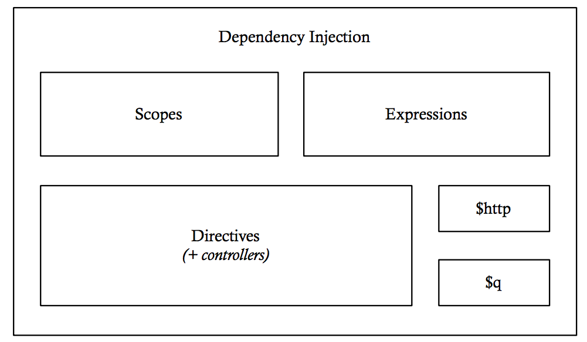

这本书是写给具有以下特质的程序员：

- 想要学习 AngularJS 的
- 已经知道 AngularJS，想要进一步学习其内部运行机制的
- 想要了解如何构建一个大型 JavaScript 应用框架的

AngularJS 并不是一个小型框架。
它的覆盖面很广泛，还定义了很多新的概念，需要我们掌握。
它的代码库也很庞大，有3.5万行 JavaScript 代码。
尽管这些新的概念和如此之多的代码为你构建自己的应用提供了强大的工具，但随之而来的是一个陡峭的学习曲线。

我很讨厌使用我不太理解的技术。
因为这往往会导致代码只是恰巧能够运行，而这种运行，不是因为你真正理解了它的作用，而是你经历了大量的实验和试错。
这样写出来的代码是很难被维护和调试的。
你也无法解释你是如何解决问题的。
你只是敲代码，直到看上去是正确运行了。

像 Angular 这样强大的框架，是很便于使用的。不过，
你理解 Angular 是如何做依赖注入的么？
你知道作用域继承的机制么？
当嵌入指令的时候实际发生了什么？
当你不知道这些东西是如何工作的时候，就像我刚开始使用 Angular 时候那样，你不得不完全按照文档或者 Stack Overflow 里面别人说的那样去使用。
当这些依然不够用的时候，你就得不断尝试新的写法，直到试出你想要的结果。

事实上，虽然 AngularJS 有很多代码，但是它们都 *只是很普通的 JavaScript 代码*。
跟你在你自己应用里写的代码没什么两样。
它们中的大多数都是易于阅读的。
你可以通过学习它来理解 Angular 是如何实现自己的功能的。
当你做完了这些，再处理日常开发遇到的问题时，会更加得得心应手。
你会不仅知道 Angular 提供了什么特性去解决特定问题，还会知道这些特性是如何工作的，如何充分得利用它们，以及有哪些不足之处。

这本书的目的就是帮助你了解 AngularJS 的内部工作原理。
把它拆解开，然后再重新拼装到一起，来真正地理解它是如何工作的。
一个真正的匠人对他的工具都了如指掌。
所以，如果需要的话，他们实际上可以做自己的工具。
这本书会帮助你对于 AngularJS 达到这个水平。

## 如何阅读这本书

贯穿全书，我们将构建一个 AngularJS 的实现。
我们将从一个完全空白的板块开始，在每个章节给我们的实现扩展新的功能。

在“第一部分”，我们从实现 *脏检查* 和 Angular Scope 的 *事件* 特性开始。
我们会对 **$watch, $watchCollection, $digest, $apply, $evalAsync, $emit, $broadcast** 等的内部运行机制非常熟悉。

在“第二部分”中，我们将添加 *表达式* ——模板中被放在双花括号里面的字符串 **{{curly braces}}** 的支持，偶尔我们使用 **$watch**。
这个看似简单的特性实际上带我们进入了深入和激动人心的对编程语言解析、词法和抽象语法树世界的旅程。
在这部分，我们还将介绍 *过滤器*，一个与表达式紧密结合的功能。

在“第三部分”中，我们讨论 *依赖注入*。
我们将从此了解 Angular 的 *providers, services* 和 *factories* 是如何实现的，以及 Angular *模块* 是如何工作的。
我们还会把前两部分的代码更新到 DI 系统，来得到一个类似集成框架的东西。

在“第四部分”，我们写几个 Angular 应用程序的核心工具：**$q** 中的 *promise* 实现和 **$http** 中的 *HTTP 客户端* 实现。
这些不仅仅对应用开发者的理解大有裨益，而且是指令的重要组成部分。

最后一部分，“第五部分”，我们终于进入 *指令* 的学习。
这是本书最先进的部分，因为它实现了 AngularJS 最强大、最复杂的子系统：指令编译器。
我们将谙练 DOM *编译* 和 *绑定*，Attributes 对象，隔离作用域，控制器，互斥和插值。
在最后一章中，我们把所有的东西放在一起，看看 Angular 真正如何 *引导* 和 *启动* 一个应用程序。

虽然 Angular 中某些功能在很大程度上是独立的，但是大多数代码都是基于前面章节中实现的代码。
这就是为什么顺序阅读将有助于你从这本书中得到最大收益。
这本书的格式很简单：每一个特性都是围绕讨论它是什么以及为什么需要它来介绍的。
我们将遵循测试驱动开发流程：先编写失败的测试，然后编写代码使它们通过。
因此，我们不仅产出了框架的源码，还产出了配套的测试用例。

强烈鼓励你不仅是阅读这些代码，而且要亲手去编写这些代码，并在阅读本书的同时构建自己的 Angular。
要想真正确保你已经掌握了一个概念，就得从不同的方向考验它：编写额外的测试用例。
用一些办法故意得去打破它的准确性。
在保证代码通过测试用例的前提下，重构它，以满足你自己的编码风格。

如果你只对框架的某些部分感兴趣，请随意跳到你感兴趣的章节。
虽然你可能需要偶尔回顾一下，但你应该能够轻易地将 Angular 最好的部分挖到自己的应用程序或框架。

## 源代码

本书中实现的源代码和测试套件可以在GitHub上找到，网址为 https://github.com/teropa/build-your-own-angularjs/ 。

为了使跟踪代码更容易，仓库中提交的顺序完全按照在书中被提及的顺序。
要注意的是，这意味着在本书的生产期间，代码库会随着修订而改变。

每个章节还对应一个 Git 标签，指向该章结束时代码库的状态。
您可以从 https://github.com/teropa/build-your-own-angularjs/releases 下载与这些标记对应的代码的归档。
